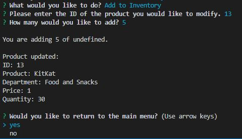

# bamazon_manager
The manager view of an Amazon-like storefront using MySQL

## Technologies Used
Node.js, MySQL, Inquirer

## Overview

Create an Amazon-like storefront using MySQL and Inquirer. The app will take in orders from customers and deplete stock from the store's inventory. The app  can also track product sales across your store's departments and then provide a summary of the highest-grossing departments in the store.

## Before You Begin

Run "npm install" to download the dependencies for this project.

## Instructions

* Create a new Node application called `bamazonManager.js`. Running this application will:

  * List a set of menu options:

    * View Products for Sale
    
    * View Low Inventory
    
    * Add to Inventory
    
    * Add New Product

  * If a manager selects `View Products for Sale`, the app should list every available item: the item IDs, names, prices, and quantities.

    

  * If a manager selects `View Low Inventory`, then it should list all items with an inventory count lower than five.

    

  * If a manager selects `Add to Inventory`, your app should display a prompt that will let the manager "add more" of any item currently in the store.

    

  * If a manager selects `Add New Product`, it should allow the manager to add a completely new product to the store.

    

  * If a manager selects `Display Sales Figures`, it should display the sales figures and the highest grossing department and end the connection.

    
